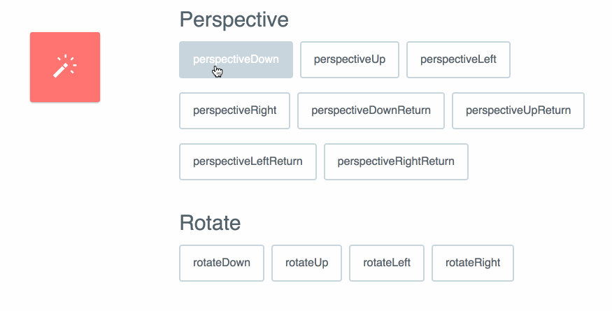

# PostCSS Magic Animations [![Build Status][ci-img]][ci]

[PostCSS]: https://github.com/postcss/postcss
[ci-img]:  https://travis-ci.org/nucliweb/postcss-magic-animations.svg
[ci]:      https://travis-ci.org/nucliweb/postcss-magic-animations

[PostCSS](https://github.com/postcss/postcss/) plugin that adds `@keyframes` from [Magic Animations](https://github.com/miniMAC/magic)



#### Input
```css
.animation {
  animation-name: magic;
}
```

#### Output
```css
.animation {
  animation-name: magic;
}
@keyframes magic {
  0% {
    opacity: 1;
    transform-origin: 100% 200%;
    transform: scale(1, 1) rotate(0deg);
  }
  100% {
    opacity: 0;
    transform-origin: 200% 500%;
    transform: scale(0, 0) rotate(270deg);
  }
}
```

## Install
```
npm install postcss-magic-animations --save-dev
```

## Usage

```js
postcss([ require('postcss-magic-animations') ])
```

See [PostCSS](https://github.com/postcss/postcss) docs for examples for your environment.

## Options

Call plugin function to set options:

```js
postcss([ require('postcss-magic-animations({atRoot: true})') ])
```

### `atRoot`

Defines `atRoot: true` to prevent the `@keyframes` can be nested in a ​**media queries**

#### Input
```css
@media only screen and (min-width: 600px) {
  .animation {
    animation-name: magic;
  }
}
```

#### Output
```css
@media only screen and (min-width: 600px) {
  .animation {
    animation-name: magic;
  }
}
@keyframes magic {
  0% {
    opacity: 1;
    transform-origin: 100% 200%;
    transform: scale(1, 1) rotate(0deg);
  }
  100% {
    opacity: 0;
    transform-origin: 200% 500%;
    transform: scale(0, 0) rotate(270deg);
  }
}

```


## Thanks
* [@miniMAC](https://github.com/miniMAC) for [magic](https://github.com/miniMAC/magic)
* [@zhouwenbin](https://github.com/zhouwenbin) for the inspiration with [PosCSS Animation](https://github.com/zhouwenbin/postcss-animation)
* [@carlosvillu](https://github.com/carlosvillu) for the help to get a ninja code
